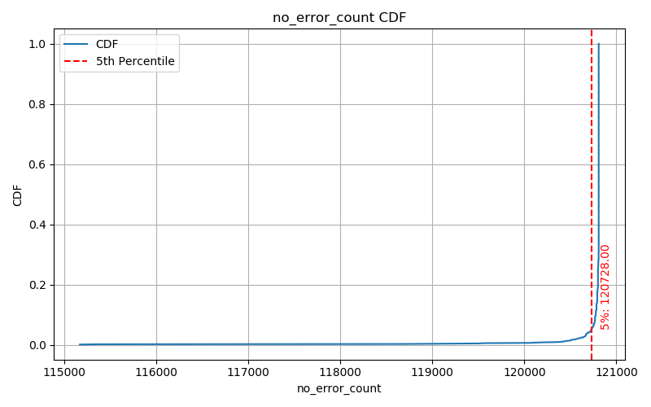
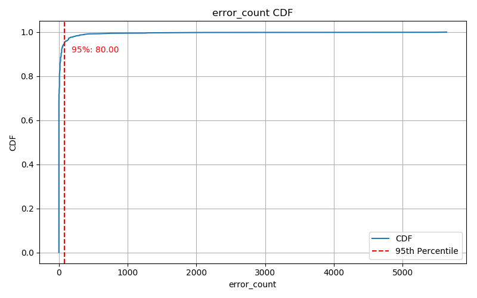
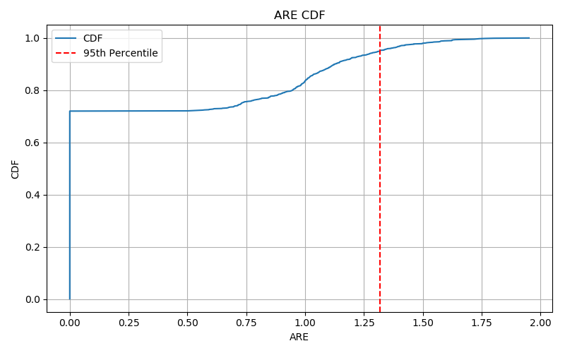

# 一、流量子流数据集构造说明文档

本说明文档描述了如何构建用于多级 Sketch 流量分析实验的合成数据集，数据结构符合真实网络环境中小流/大流混合、多端口拆分、首包识别等特征需求。

---

## 1. 目标
构造模拟网络流量的包级数据文件 `flow_port_mixed.txt`，用于测试 Bloom + CM Sketch 结构的插入与上报效果。每条数据为：

```
flow_id port_id size
```

- 每一行为一个子流包插入指令。
- 真实流量大小将被分配到多个端口，模拟真实场景中的服务端口绑定或 NAT 多路径。
- 数据将用于触发 Bloom 层级首次包判定和误报统计。

---

## 2. 流类型设计
数据集中包含两类流：

| 流类型 | 字节范围 | 包大小 | 子流比例 | 子流端口数 |
|--------|-----------|--------|-----------|-------------|
| 小流   | 10–100 KB | 1 KB    | 93%       | 64–288 个端口 |
| 大流   | 10–100 GB | 1.5 KB  | 7%        | 64–288 个端口 |

- 每条流的字节数将被随机分配到多个端口，形成多个子流；
- 为确保 **最终子流级别的大流比例为 7%**，构造流程中将：
  - 控制大流在高字节范围内产生更多包；
  - 控制小流更短且分布更均匀，形成多个 size ≤ 4 的子流；
  - 在流生成完毕后统计所有子流并调整比例，保留大流子流占总子流数量约为 7%；

---

## 3. 子流格式构建逻辑
### 步骤 1：分配端口
每条流随机选择 64～288 个端口作为其子流分支。

### 步骤 2：字节划分与轮转分配
- 按包大小（1KB/1.5KB）计算总包数；
- 将包数轮转分配到每个端口，保证：
  - 包总数与字节数匹配；
  - 前若干端口可能多 1 包。

### 步骤 3：子流聚合规则（可选）
- (为了降低数据包数量太大带来的生成数据程序的时间复杂度和空间复杂度，我们将每个子流的包数量进行压缩，压缩规则如下：)
- 若一个子流的包数 ≤ 4：每个包都单独记录为 size=1；
- 若包数 > 4：前 4 个包记录为 size=1，其余聚合为 size=n-4（压缩记录）。

### 步骤 4：写入顺序控制
- 所有子流轮转插入，交错排列；
- 最后全局打乱所有包顺序，模拟真实网络到达。

---

## 4. 示例输出
```
1000000032 91 1
1000000032 91 1
1000000032 91 1
1000000032 91 1
1000000032 91 24
...
```
- 表示 flow_id 为 1000000032 的流，在 port 91 上产生了 28 个包：
  - 前 4 个包为首包阶段（size=1）
  - 后续 24 个包压缩为一行（size=24）

---

## 5. 输出文件格式
- 文件名：`flow_port_mixed.txt`
- 编码格式：UTF-8
- 每行格式：`flow_id port_id packet_count`
- 行数 ≈ 包总数（聚合后）

---

## 6. 典型配置参数
| 参数         | 数值范围       |
|--------------|----------------|
| 流数量       | 默认 2,000 条（需调整） |
| port号范围    | 1-288       |
| 小流比例     | 97%-98%（需调整）            |
| 大流比例     | 2%-3%（需调整）             |
| 子流中小流比例     | 93%            |
| 子流中大流比例     | 7%             |
| 包大小       | 1 KB / 1.5 KB  |
| 流字节数范围 | 10KB–100GB     |


-流数量需调整使其分端口后子流数量约为 120,000 条；
- 小流比例需调整使其分端口后小流子流数量约占93%；
- 大流比例需调整使其分端口后大流子流数量约占7%。

## 7. 后续用途
该数据集可用于：
- 数据平面 Sketch 插入测试（触发 Bloom/CMS）
- 解码算法测试（decoder + control plane）
- 精细化子流分类修正分析（如 refine eq2）

---

<div style="page-break-after: always;"></div>

# 二、数据平面结构说明文档

本说明文档详细介绍数据平面中用于流量估计与上报触发的四级 Sketch 结构，包括其模块组成、插入判断逻辑、上报机制与应用场景。

---

## 1. 总体结构概览

数据平面结构为 **三级 Bloom Filter + 一层 Count-Min Sketch (CM Sketch)** 的分级设计。

```
┌────────────┐      ┌────────────┐      ┌────────────┐      ┌────────────┐
│ BloomFilter│ ──→ │ BloomFilter│ ──→ │ BloomFilter│ ──→ │ CountMinSketch │
│    L1      │      │    L2      │      │    L3      │      │     L4       │
└────────────┘      └────────────┘      └────────────┘      └──────────────┘
```

每一级依次判断是否已“见过”流（通过哈希判断），若未见过即触发上报并停止流入更深层；
仅当所有 Bloom 都命中时，才进入 Count-Min Sketch。

---

## 2. 模块参数与定义

### BloomFilter（第1-3层）

- 参数：
  - `k`: 哈希函数数量（推荐 2）
  - `m`: 位数组长度（通过实验测算）
- 功能：判断是否见过该流（false positive 可控）
- 哈希结构：
  - `h_i(x) = (a_i * x + b_i) % p_i % m`
  - p_i 保证不同层使用互异素数，提高独立性

### CountMinSketch（第4层）

- 参数：
  - `d`: 哈希函数数量（行数，推荐3）
  - `w`: 每行桶数
- 功能：用于估计流大小（受限于最小值、哈希冲突）
- 上报触发条件：
  - 查询结果为 0，表示流首次抵达计数阶段

---

## 3. 插入流程逻辑

### 插入函数 `insert(flow_id, value=1)`：

```python
if not bloom1.contains(flow_id):
    report(level=1)
    bloom1.insert(flow_id)
elif not bloom2.contains(flow_id):
    report(level=2)
    bloom2.insert(flow_id)
elif not bloom3.contains(flow_id):
    report(level=3)
    bloom3.insert(flow_id)
else:
    if cms.query(flow_id) == 0:
        report(level=4)
    cms.insert(flow_id, value)
```

### 查询函数 `query(flow_id)`：

- 仅用于 CountMinSketch 查询，不再触发上报。
- 用于控制面合并查询：`cm.query(fid) + control_plane.query(fid)`

---

## 4. 上报逻辑与控制平面接口

所有上报 flow_id 会按触发层级分类记录：

```python
self.reported_to_control_plane = {
    1: set(),  # L1 未命中
    2: set(),  # L2 未命中
    3: set(),  # L3 未命中
    4: set(),  # CM 查询为 0
}
```

控制平面接收上报后可以：

- 建立完整 flow → counter 字典（初值 0）
- 在收到进一步插入时增量更新
- 解码时合并 CountMinSketch 与控制面估值

---

## 5. 哈希函数设计

- 使用素数池：

```python
[6296197, 2254201, 7672057, 1002343, 9815713, 3436583, 4359587, 5638753, 8155451]
```

- 每层 Bloom 和 CM 使用 disjoint 的 p 集合，避免哈希冲突传播。
- 每个哈希函数格式： `(a * x + b) % p % w`

---

## 6. 空间开销估算

| 层级 | 类型 | 长度参数 | 哈希数 | 空间公式 | 示例大小 |
|------|------|----------|--------|-----------|------------|
| L1   | Bloom | m1       | k1     | m1 bits   | 200,000 bits (25 KB) |
| L2   | Bloom | m2       | k2     | m2 bits   | 100,000 bits (12.5 KB) |
| L3   | Bloom | m3       | k3     | m3 bits   | 40,000 bits (5 KB)  |
| L4   | CM    | d×w      | d      | d×w×b bits | 3×6,000×20 bits = 360,000(45 KB) |

---

## 7. 典型应用与优势

- 多级 Bloom 屏蔽大部分流重复上报，控制 plane 负载降低；
- Bloom 误报会少量影响控制面上传，但通过多级bloom使误判可控；
- 对真正活跃流（如大流）可快速穿透进入 CM 记录；
- 利于分级采样、上报优化、精准首包识别等场景。

---

<div style="page-break-after: always;"></div>

# 三、控制平面结构与解码流程说明文档

本说明文档详细描述在 Bloom+CM 多级 Sketch 流量测量架构中，控制平面的职责、结构设计与解码流程。控制面用于辅助恢复误判/误报流的真实大小，特别是通过首包上报机制触发记录的流。

---

## 1. 控制平面作用

控制平面承担以下核心任务：

- 接收并记录来自数据平面上报的 flow_id；
- 持续记录上报流的计数累积（插入）；
- 与数据平面计数器联合查询，提高估值准确性；
- 解码（恢复）子流真实大小；
- 分析误报/漏报行为，优化上报策略。

---

## 2. 上报来源结构

数据平面 `FourLevelSketch` 在四个阶段触发上报：

| 层级 | 上报条件 | 示例值 |
|------|----------|--------|
| L1   | Bloom1 未命中 | `report[1].add(flow_id)` |
| L2   | Bloom2 未命中 | `report[2].add(flow_id)` |
| L3   | Bloom3 未命中 | `report[3].add(flow_id)` |
| L4   | CM 查询为 0   | `report[4].add(flow_id)` |

---

## 3. 控制面结构设计

控制平面以字典形式维护已上报的流：

```python
self.control_dict = {
    flow_id1: total_count1,
    flow_id2: total_count2,
    ...
}
```

### 核心方法：

- `increment(flow_id, value)`：插入更新；
- `query(flow_id)`：返回当前已累计的值；
- `merge_query(flow_id, sketch)`：与数据平面估值合并（叠加）；
- `decode_all()`：返回所有已知流及其累计大小。

---

## 4. 解码流程概述

控制平面支持解码误报流的真实大小，特别是从上报集合中解析被误触的流。

### 解码输入：

- 数据平面上报集合（各级 flow_id）；
- 数据平面 CM 的矩阵结构；
- 所有上报流当前的 control_dict 中值。

### 解码核心逻辑：

1. 标记所有上报流；
2. 遍历 CM 矩阵，识别 **pure counter**（只被一个流映射）；
3. 从 pure counter 反推出该流大小；
4. 将该流从其他 counter 中消除影响；
5. 迭代更新，直到无新 pure counter 可用。

---

## 5. 子流大小解码示例

```python
flow -> (hash_row_1, col_1)
      -> (hash_row_2, col_2)

if both counters = 5, and only mapped by this flow:
  → flow size = 5
  → remove from other counters
```

### 多轮迭代解码

- 每轮解出 1 个或多个 pure 流；
- 更新后有可能新出现 pure counter；
- 最终无法解出的保留为“未解码”。

---

## 6. 解码输出与评估指标

### 输出结构：

- `decoded_flows: {flow_id: size}`
- `undecoded_flows: {flow_id}`
对于未解码的流，输出为：CM查询值（后续也有优化策略）

-备选优化策略1：未解码流的数量较低，可以通过列方程Ax=y（x,y的维度较小）求解（参考CS Sketch），得到未解码流的真实大小。
-备选优化策略2：counter按照内部流的数量进行等比缩减，再查询。

### 评估指标：

- 解码成功率（解出 / 上报）
- 解码误差（相对误差）
- 按大小分段的解码覆盖率与精度

---

## 7. 上下游配合建议

| 数据平面        | 控制平面                 |
|----------------|--------------------------|
| 上报 flow_id    | 建立记录结构              |
| 查询值为 0 时上报 | 控制平面独立累计计数      |
| 可导出矩阵结构  | 用于支持解码 pure counter |
| 插入前判定 bloom | 提供首次包估计              |

---

## 8. 可扩展方向

- 控制面支持“上报流统计压缩存储”（bitmap/Sketch）；
- 支持“部分解码 + 优先回收”；
- 引入流等级分类（高频/低频）优化解码顺序；
- 多线程解码并行计算支持。
- 未解码的流相对较少，可以通过列方程求解。

---

<div style="page-break-after: always;"></div>

# 四、模拟实验与结果分析说明文档

本说明文档描述了使用四级 Bloom+CM Sketch 结构进行网络流测量实验的完整流程，包括实验步骤、评估指标与结果分析方法。该流程适用于测试子流上报准确率、解码性能与误差控制能力。

---

## 1. 实验目标

通过模拟流量数据集，评估多级 Sketch 系统在以下方面的性能：

- 子流首包触发上报的准确性；
- 解码成功率与误差；
- 不同大小子流的误报 / 漏报率；
- 控制平面与数据平面协作效果。

---

## 2. 实验流程总览

```
数据生成 → 分类标注 → 插入数据平面 → 上报收集 → 控制面计数 → 解码分析 → 准确率误差评估
```

---

## 3. 步骤详解

### 步骤 1：构造数据集

使用 `getelephantflowdata.py` 脚本生成 `flow_port_mixed.txt`：

- 含小流 / 大流；
- 每流被拆为多个端口子流；
- 每子流记录包数。

### 步骤 2：分类标注

- 加载子流 → 根据总包数划分：
  - `=1`：小流首包；
  - `=2`：中间模糊区域；
  - `>2`：大流稳定子流；
- 使用 `refine_eq2_with_fid_majority()` 对等于 2 的子流进一步聚类判断归类。

### 步骤 3：插入数据平面结构

- 使用 `FourLevelSketch.insert(flow_id, value)` 插入；
- 多级 Bloom 筛选 → CountMin 插入；
- 若首次 Bloom/CM 判定失败则记录上报；

### 步骤 4：控制面累计

- 接收所有上报流；
- 每次插入 flow_id 时也 `control.increment(flow_id)`；
- 形成 control_dict：子流→累积值。

### 步骤 5：查询 / 解码

- 查询可采用：
  - `query(flow_id)` → 仅数据平面；
  - `merge_query(flow_id)` → 数据平面 + 控制面；
- 解码模块支持 pure counter 解码（详见 decoder.py）；

### 步骤 6：结果分析与评估

- 按子流大小（真实分类）统计：
  - 命中（TP）、漏报（FN）、误报（FP）；
- 分别输出：
  - 上报总数；
  - 每类 FN/FP/TP；
  - 解码成功率；
  - 平均相对误差（ARE）；
- 可进一步统计 Bloom/CMS 各层触发频率。

---

## 4. 样例输出格式（控制台）

```
{'k1': 2, 'k2': 2, 'k3': 2, 'd4': 3, 'm1': 200000, 'm2': 100000, 'm3': 40000, 'w4': 5000}
Size 1: 110289
Size 2: 702
Size > 2: 8413
Report Count per Level:
  Level 1: 96261 flows reported
  Level 2: 27208 flows reported
  Level 3: 8305 flows reported
  Level 4: 6897 flows reported

False Positive Rate Estimation:
  true total: 119404
  reported total: 119404
  false positives: 0
  false negatives: 0
  false positive rate: 0.0000
  false negative rate: 0.0000

Analysis of Reported Flows:

Analysis of Single-Report Flows:
  Total Queried Once with Value 1: 110311
  False Positives: 22
  True Positives: 110289
  False Positive Rate: 0.0002

Analysis of Double-Report Flows:
  Total Queried Twice with Value 2: 1279
  False Positives: 578
  True Positives: 701
  False Positive Rate: 0.4519

Analysis of Three-or-More-Report Flows:
  Total Queried Three or More: 7814
  False Positives: 1
  True Positives: 7813
  False Positive Rate: 0.0001

=== After refine_eq2_with_fid_majority ===
Size 1: 110289
Refined Size 2: 701
Refined Size > 2: 8414
=== Refined vs Ground Truth Classification Accuracy ===
Size = 1     | TP: 110289, FP: 0, FN: 0, Accuracy: 1.0000
Size = 2     | TP: 701, FP: 0, FN: 1, Accuracy: 1.0000
Size > 2     | TP: 8413, FP: 1, FN: 0, Accuracy: 0.9999
Decoded flows: 8414
Undecoded flows: 0

Analysis of Decoded Flows:
  Total Decoded: 8414
  Average Relative Error: 0.0000
  Accurate Decoded: 8413
  Counter Accuracy: 0.9999
```

---

## 5. 指标定义

| 指标             | 含义                           |
|------------------|--------------------------------|
| TP               | 正确上报的真实子流             |
| FN               | 未被上报的真实子流             |
| FP               | 上报但不在真实集合中的子流     |
| FN rate          | FN / True set                  |
| FP rate          | FP / Reported set              |
| 解码成功率       | 被 decoder 解出的子流占比       |
| 解码平均误差（ARE） | ∑|估值-真实| / 真实总和         |
等
---

## 6. 拓展分析方向

- 多参数 sweep（调节 Bloom 长度、CM 宽度）；
- 可视化输出 FP/FN 趋势；
- 首包识别准确率 vs 子流大小分布；
- Bloom 层次命中分布分析；
- 控制面流重建能力评估。

---

## 7. 主要涉及文件

| 模块 | 文件 |
|------|------|
| 数据生成 | getelephantflowdata.py |
| 数据平面结构 | bloom_cm.py |
| 控制与解码 | decoder.py |
| 主控与分析 | test_bc.py |

---

# 结果

## 重复实验1000次，实验结果如下：
### 1000次实验下，无误差的子流数量的CDF图：
平均无误差的子流数量 average no_error_count: 119324.755


### 1000次实验下，有误差的子流数量的CDF图：
平均有误差的子流数量 average error_count: 79.245


<!-- ### 1000次实验下，有误差的流的平均误差的CDF图：
平均有误差的流的ARE average ARE：0.6435398112629712
 -->

